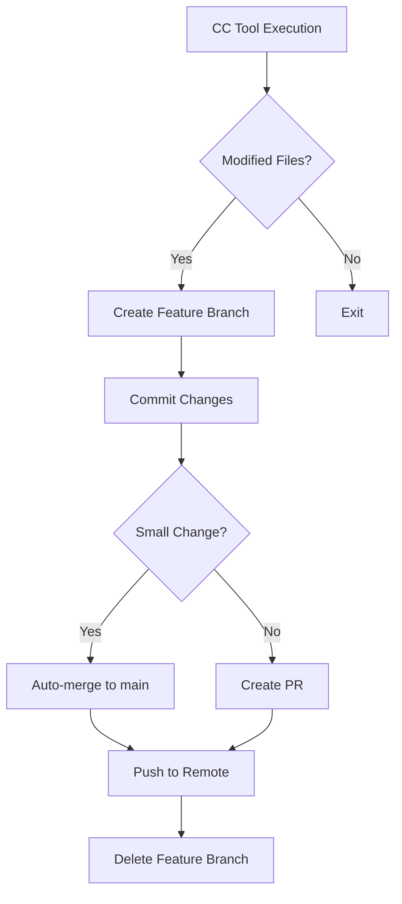

# Auto-Commit Hook System for Claude Code

Automatically commits changes after every CC task completion, creating feature branches and merging to main.

## Features

- **Automatic Branch Creation**: Creates feature branches for all changes
- **Smart Auto-Merge**: Automatically merges small changes to main
- **PR Creation**: Creates pull requests for large changes
- **Task-Based Commits**: Commits when TodoWrite tasks are marked complete
- **Configurable Thresholds**: Customize when to commit, merge, and create PRs
- **Background Operation**: Non-blocking, runs in background
- **Multi-Project Support**: Works across all git repositories

## Installation

1. Copy hooks to Claude Code config:
```bash
cp hooks/auto-commit/*.sh ~/.config/claude/hooks/
chmod +x ~/.config/claude/hooks/*.sh
```

2. Configure settings:
```bash
~/.config/claude/hooks/configure-auto-commit.sh
```

3. The hooks are automatically integrated with the PostToolUse hook.

## Configuration

Edit `~/.claude/auto-commit.conf`:

```bash
# Core Settings
ENABLED=true                    # Enable/disable auto-commit
COMMIT_THRESHOLD=5              # Commit after N file changes
TIME_THRESHOLD=300              # Min seconds between commits
AUTO_MERGE_THRESHOLD=10         # Auto-merge if <= N files
CREATE_PR_THRESHOLD=20          # Create PR if > N files

# Strategy
COMMIT_STRATEGY="branch"        # "branch" or "direct"
AUTO_PUSH=true                  # Push to remote
DELETE_MERGED_BRANCHES=true     # Clean up after merge
```

## How It Works

### 1. File Modification Trigger
When CC uses Write/Edit/MultiEdit tools:
- Hook checks for uncommitted changes
- Creates feature branch: `cc-auto-{tool}-{timestamp}`
- Commits with descriptive message
- Auto-merges if below threshold

### 2. Task Completion Trigger
When TodoWrite marks tasks complete:
- Commits all pending changes
- Creates branch: `cc-task-{timestamp}`
- Includes task details in commit message
- Creates PR for large changes

### 3. Auto-Merge Logic
```
if (files_changed <= AUTO_MERGE_THRESHOLD) {
    merge to main
    delete feature branch
    push to remote
} else {
    keep feature branch
    create PR if possible
}
```

## Workflow



## Commands

### Enable/Disable
```bash
# Enable auto-commit
echo "ENABLED=true" > ~/.claude/auto-commit.conf

# Disable auto-commit
echo "ENABLED=false" > ~/.claude/auto-commit.conf
```

### Check Logs
```bash
# View auto-commit logs
tail -f ~/.claude/logs/auto-commit.log

# View task commit logs
tail -f ~/.claude/logs/task-commit.log
```

### Manual Trigger
```bash
# Manually trigger auto-commit
CLAUDE_TOOL_NAME=Write ~/.config/claude/hooks/auto-commit-hook.sh
```

## Examples

### Example 1: Small Edit
```
1. CC edits 3 files
2. Hook creates branch: cc-auto-edit-20240113-142530-a1b2c3
3. Commits: "feat: auto-commit after Edit operation"
4. Auto-merges to main (below threshold)
5. Pushes to remote
6. Deletes feature branch
```

### Example 2: Large Feature
```
1. CC creates 25 new files
2. Hook creates branch: cc-auto-write-20240113-143015-d4e5f6
3. Commits: "feat: auto-commit after Write operation"
4. Creates PR (above threshold)
5. Branch remains for review
```

### Example 3: Task Completion
```
1. TodoWrite marks task complete
2. Hook detects completion
3. Creates branch: cc-task-20240113-144500
4. Commits with task details
5. Auto-merges or creates PR based on size
```

## Best Practices

1. **Set Appropriate Thresholds**: Adjust based on your workflow
2. **Review Large PRs**: Manually review PRs above threshold
3. **Monitor Logs**: Check logs for any issues
4. **Clean Up Branches**: Periodically clean old branches
5. **Configure Excludes**: Exclude test/temp projects

## Troubleshooting

### Commits Not Happening
- Check if enabled: `cat ~/.claude/auto-commit.conf | grep ENABLED`
- Check logs: `tail ~/.claude/logs/auto-commit.log`
- Verify git config: `git config user.name && git config user.email`

### Merge Conflicts
- Hook will keep feature branch if merge fails
- Manually resolve: `git checkout <branch> && git merge main`

### Performance Issues
- Increase TIME_THRESHOLD to reduce frequency
- Exclude large repositories
- Disable for specific projects in config

## Advanced Configuration

### Custom Commit Templates
```bash
COMMIT_TEMPLATE="[CC-AUTO] {TOOL} modified {FILES} files

Automated commit by Claude Code
Session: {SESSION_ID}
Timestamp: {TIME}"
```

### Project-Specific Settings
Create `.claude-commit.conf` in project root to override global settings.

### Integration with CI/CD
Branches created with `cc-auto-*` pattern can trigger CI workflows:
```yaml
on:
  push:
    branches: 
      - 'cc-auto-*'
      - 'cc-task-*'
```

## Benefits

- **Never Lose Work**: All changes automatically committed
- **Clean History**: Organized feature branches
- **Automatic Workflow**: No manual git commands needed
- **Review Control**: Large changes go through PR review
- **Time Savings**: Eliminates manual commit workflow

## License

Part of Claude Code Ultimate (CCU) configuration system.